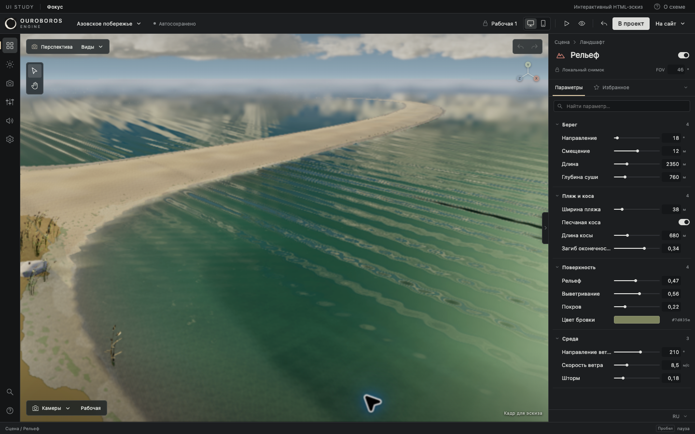
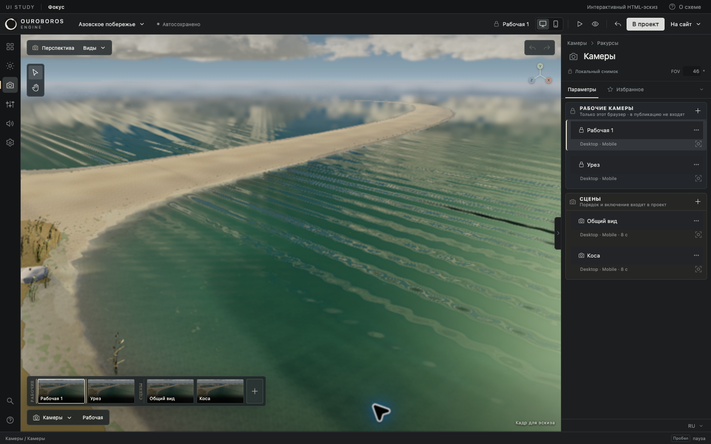

# Ouroboros — Фокус

[Открыть обновлённый HTML-эскиз](http://localhost:41218/index.html?layout=focus)

Денис выбрал «Фокус». Переключатель трёх вариантов убран; исходные превью сохранены в `previews/`.

## Управление

- **Цвет значков:** ПКМ по группе или объекту в списке открывает 15 цветов. В инспекторе палитра открывается ЛКМ или ПКМ по значку. Цвет группы наследуется объектами, пока объекту не назначен свой; «Цвет группы» возвращает наследование. Значки списка и инспектора синхронны. Метки сохраняются локально в этом эскизе.
- **Инспектор:** нажать на корешок — свернуть к правому краю; нажать на корешок у края — вернуть. Перетаскивание самой границы меняет ширину.
- **Числа:** зажать ЛКМ и двигать влево / вправо. Shift — в пять раз точнее, Esc — отменить жест. Клик оставляет точный ввод. Для параметров с ползунками один жест — один шаг отмены.
- **Камеры:** нижняя кинолента прокручивается колесом, трекпадом, перетаскиванием мышью или стрелками при фокусе. Клик по миниатюре выбирает камеру. Рабочие камеры и сцены справа разделены на отдельные блоки.
- **Избранное:** звёздочка у любого параметра закрепляет его в общей подборке.
- **Поиск:** ⌘K ищет объекты, параметры и команды. **?** открывает памятку клавиш.

Основной вход в каждый раздел — слева. Повторные кнопки поиска, справки, выбора объекта и показа инспектора убраны. Технические виды находятся только в верхнем меню «Виды». Активная камера показана в верхней строке; переключать её можно в ленте или в списке камер.

## Границы эскиза

Сцена — статичный фрагмент скриншота. Полёт, манипулятор, захват ракурса и публикация демонстрируют интерфейс. Контролы не подключены к движку, API публикации или хранилищу основного редактора. Параметры и камеры сбрасываются при перезагрузке; сохраняются только организационные цвета значков.

Каталог содержит 36 узлов в шести рабочих областях с представительными параметрами. HTML самостоятельный, без внешних библиотек. Можно открыть `index.html` в браузере, сохранив рядом остальные файлы папки. Статический сервер работает на 127.0.0.1:41218.

[Первоначальное обоснование](DESIGN.md) · [Проверки](VALIDATION.md)

